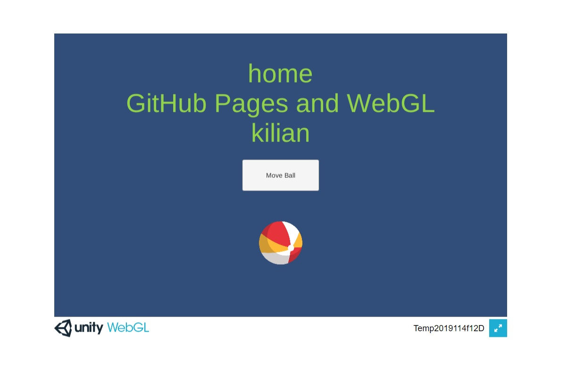

# inclass-WebGL-cs-kilian

### Project description: 
This Project was intendet as an Unity Github and C# Exercise.
It contains a Button which triggers a public function for setting a Ball
randomly to 4 predefined positions. 
That was implemented using the c# Function Random.Range() and a SerializedField 
GameObject Array in which the predefined positions are saved.

To prevent that the Ball ist set to the same position in a row twice or more, i
wrote a while loop which repeats the Random.Range() Function as long as a new
position is found. Which might not be the most efficient way 
but for a Project that size it shouldn't be problem.

You can find the hosted game on: https://3ahmnm-htlsbg.github.io/home-WebGL-movingBall-cs-kilian/

### Development platform: 

* Windows Version 10.0.17134 Build 17134
* VS Code 1.41.1
* Unity 2019.1.14f1
* Scripting Runtime Version: 4.X

### Target platform: 
WebGL

### Visuals: 

### Necessary setup/execution steps: 
WebGL needs to be installed. 

### Third party material: 
Github Template: 3ahmnm-htlsbg/Unity2019114f1-2D-Template\
Original Readme: https://github.com/3ahmnm-htlsbg/home-WebGl-cs-smeerws/blob/master/README.md &nbsp;
Project copied from: https://github.com/3ahmnm-htlsbg/home-WebGL-movingBall-cs-kilian 
&nbsp;
Because no need for a revision.

### Project state: 
incl. progress in percent 
100%

### Limitations: 

None

### Lessons Learned: 

* How to use Random Numbers
* using  GameObject.tranform.position 
* Build for WebGL
* Host with Guthub Pages

Copyright by Kilian